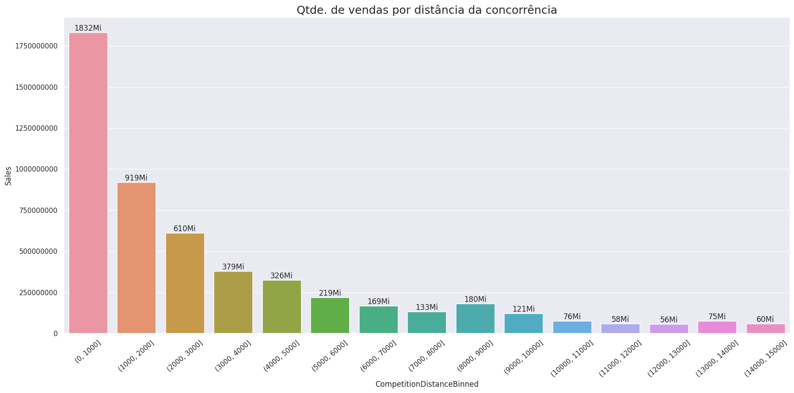
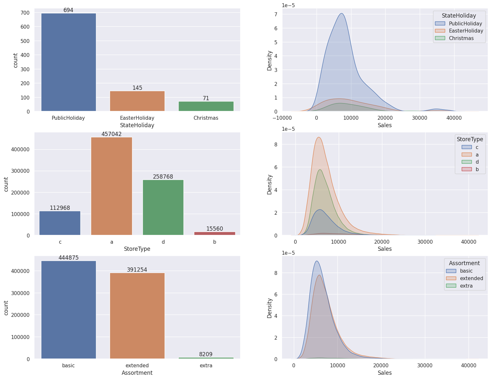

# sales-analysis-and-forecasting
O uso de Machine Learning é importante para aumentar a competitividade das empresas ao prever vendas futuras. Neste projeto foi feita uma análise e previsão de vendas de mais de mil lojas da Rossman.

Foram utiizados os seguintes algoritmos:

- Linear Regression
- Random Forest Regressor
- Lasso Regression
- XGBoost Regressor

O modelo final escolhido foi o XGBoost Regressor. Além disso, uma análise exploratória de dados foi realizada e diversos insights foram obtidos, como:

- lojas com maior sortimento vendem menos ✅
-  lojas com competidores mais próximos vendem mais ✅
-  lojas com competidores a mais tempo vendem menos ✅
-  lojas com promoções a mais tempo vendem menos, isto é, quanto mais tempo dura uma promoção, mais as vendas vão caindo ✅
-  lojas vendem menos no feriado de natal ✅
-  lojas vendem menos ao longo dos anos, e menos depois do primeiro semestre de cada ano ✅
-  as vendas apresentam uma queda ao se aproximar do final de semana ✅
-  lojas vendem menos durante os feriados escolares ✅

Amostra de gráficos construídos:

